# 安卓系统访问控制策略与机制

## 实验环境

+ Android Studio 4.2.1
+ AVD: Android 11.0 API 30 x86 - Pixel XL

## ADB实验

### 命令行

```bash
# 显示系统中全部设备
adb devices

# 连接模拟器终端
adb -s emulator-5554 shell

# 输出环境变量
echo $PATH

# 查看系统版本
uname -a

# 查看当前目录下文件
ls

# 查看防火墙规则
iptables -nL
```

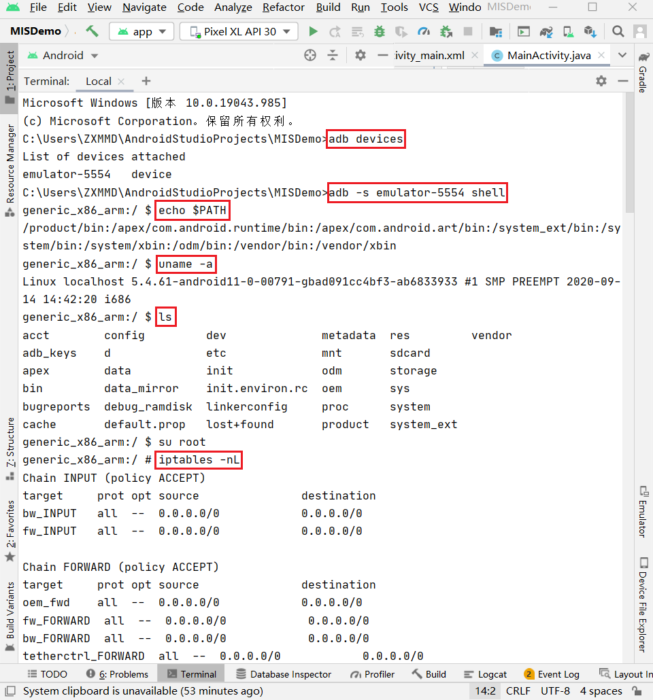

```bash
# 将文件复制到设备
adb pull remote local
```

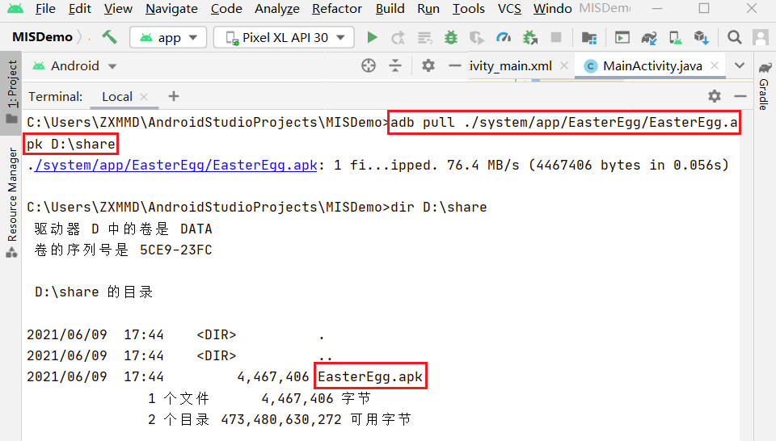

```bash
# 从设备复制文件
adb push local remote
```

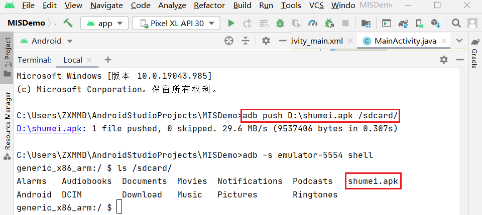

```bash
# 安装应用
adb install path_to_apk
```

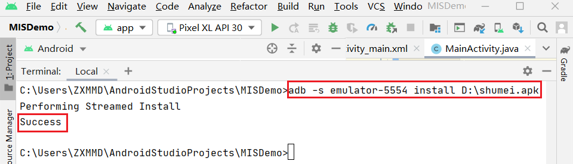

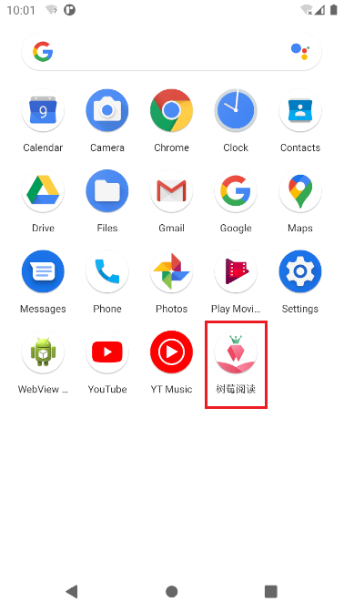

### Activity Manager (am)

```bash
# Camera（照相机）的启动方法为: 
am start -n com.android.camera/com.android.camera.Camera

# Browser（浏览器）的启动方法为：
am start -n com.android.browser/com.android.browser.BrowserActivity

# 启动浏览器 :
am start -a android.intent.action.VIEW -d  https://c4pr1c3.github.io/cuc-mis/chap0x06/exp.html

# 拨打电话 :
am start -a android.intent.action.CALL -d tel:10086

# 发短信：
adb shell am start -a android.intent.action.SENDTO -d sms:10086 --es sms_body ye --ez exit_on_sent true
```

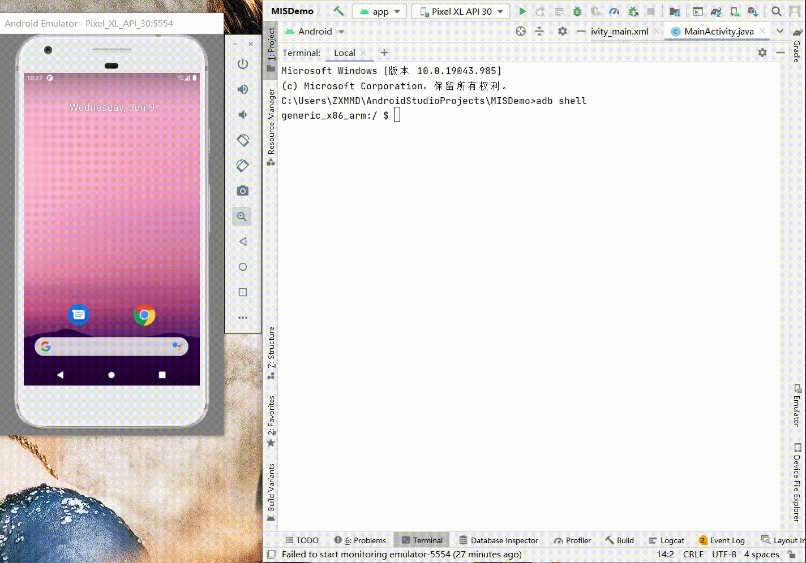

### 软件包管理器 (pm)

```bash
# 在 shell 中，此语法为：pm command

# 输出系统中的所有用户
pm list users

# 输出设备支持的最大用户数
pm get-max-users

# 显示第三方软件包
pm list packages -3

# 输出所有已知的权限组
pm list permission-groups
```

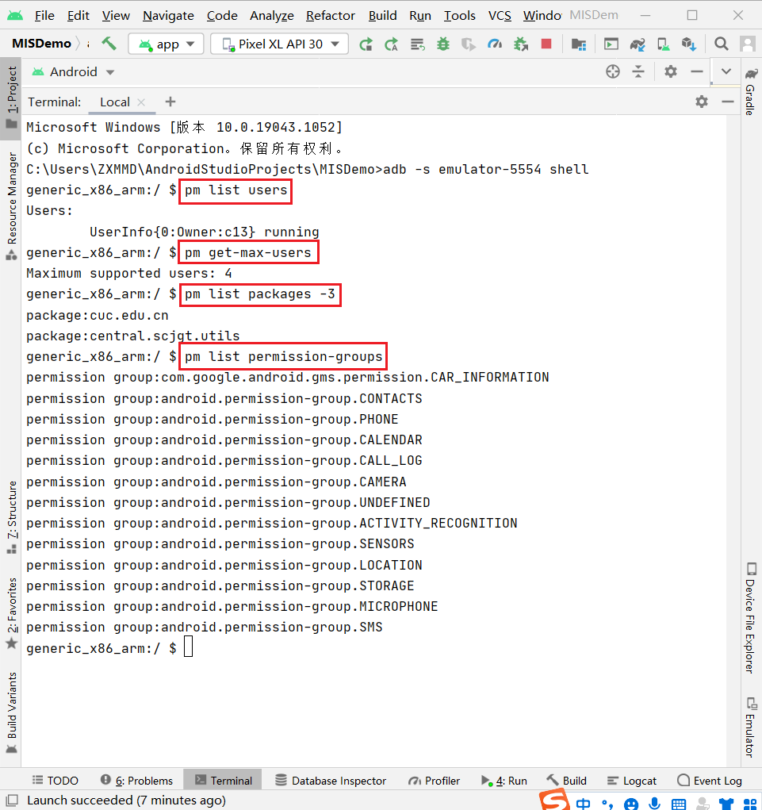

## HelloWorld v1

认真阅读Android官方给出的[使用Android Studio一步一步创建并运行的Hello World程序指南](https://developer.android.google.cn/training/basics/firstapp/creating-project.html)，根据[课本](https://c4pr1c3.github.io/cuc-mis/chap0x06/exp.html#hello-world-v1)要求进行如下设置：

+ Application Name设置为：MISDemo

+ Company Domain设置为：cuc.edu.cn

运行结果：

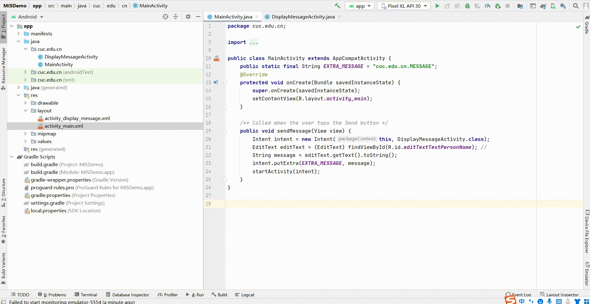

### 回答问题

+ [x] 按照向导创建的工程在模拟器里运行成功的前提下，生成的APK文件在哪儿保存的？
  
  + 如下图所示：

    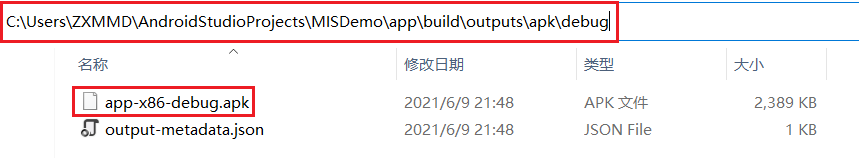

+ [x] 使用`adb shell`是否可以绕过`MainActivity`页面直接“唤起”第二个`DisplayMessageActivity`页面？是否可以在直接唤起的这个`DisplayMessageActivity`页面上显示自定义的一段文字，比如：你好移动互联网安全

  + 可以。如下图所示：

    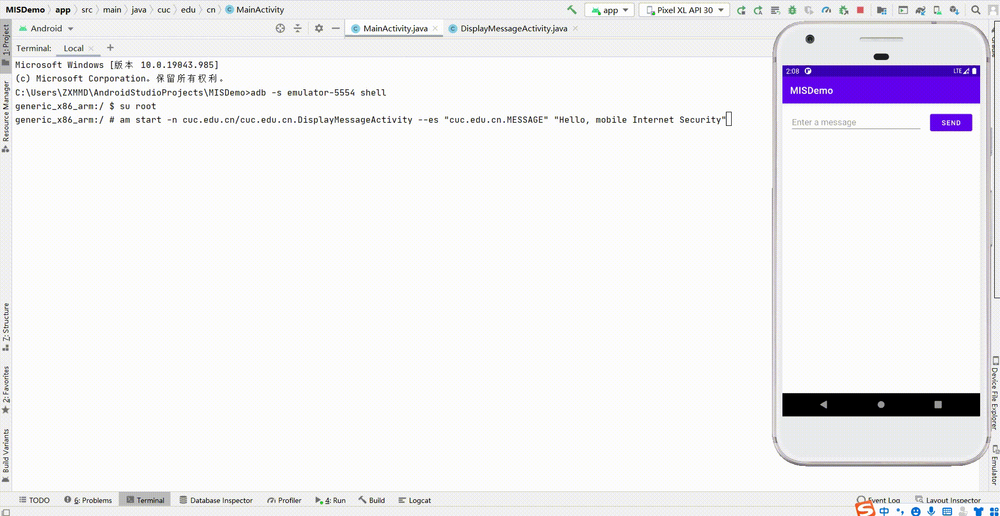

+ [x] 如何实现在真机上运行你开发的这个Hello World程序？

  + [官网给出的方法](https://developer.android.com/training/basics/firstapp/running-app),经测试可以使用。

  + 一个简单粗暴的方法是直接将生成的apk文件传输到手机上安装运行

    

+ [x] 如何修改代码实现通过 `adb shell am start -a android.intent.action.VIEW -d http://sec.cuc.edu.cn/ `可以让我们的 `cuc.edu.cn.misdemo` 程序出现在“用于打开浏览器的应用程序选择列表”？

  ```bash
  # 在 MISDemo\app\src\main\AndroidManifest.xml 中添加以下代码
  <action android:name="android.intent.action.VIEW" />
  <category android:name="android.intent.category.DEFAULT" />
  <category android:name="android.intent.category.BROWSABLE" />
  <data android:scheme="http" />
  ```

  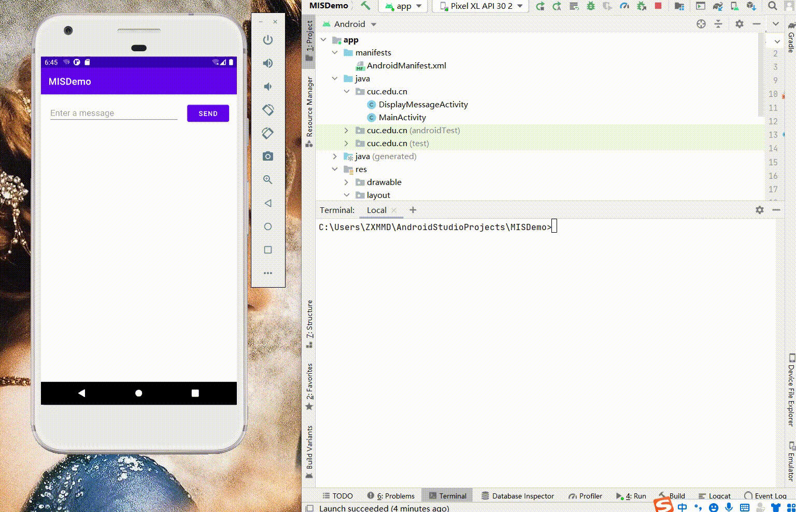

+ [x] 如何修改应用程序默认图标？

  + 通过`app -> New -> Image  -> Image Asset`, 选择自定义的图片作为图标。

    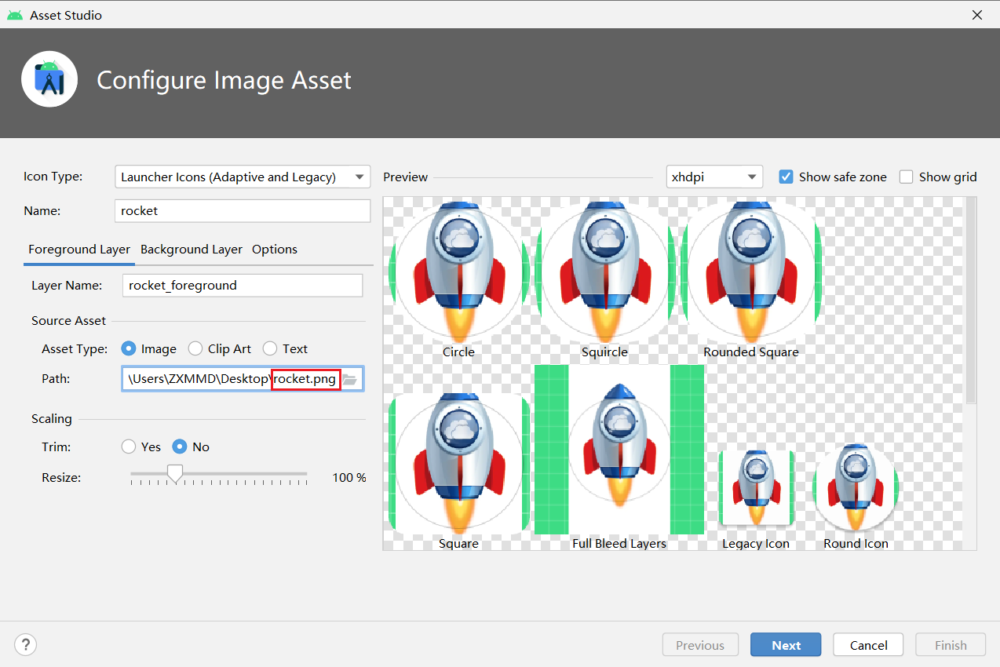

  + 在`AndroidManifest.xml`中做出相应修改

    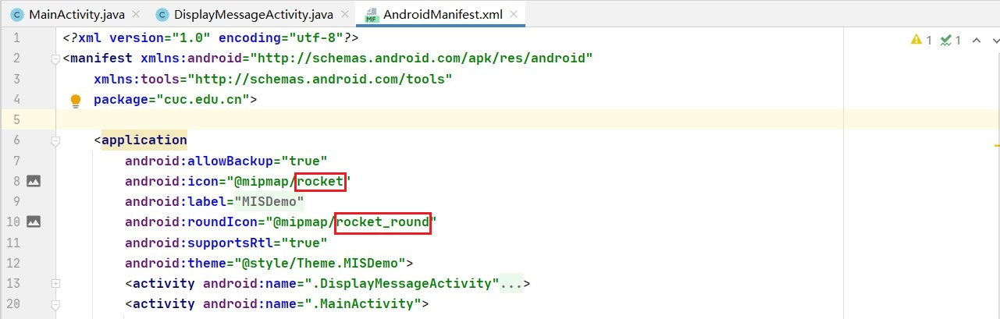

  + 修改后的程序图标如下图所示：
  
    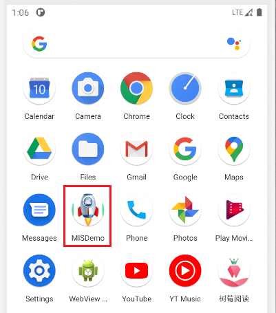

+ [x] 如何修改代码使得应用程序图标在手机主屏幕上实现隐藏？

  + 在 `MISDemo\app\src\main\AndroidManifest.xml` 中添加以下代码, 原理是把app的入口Activity申明为由接收隐式的Intent来启动，这样就不会显示图标了

    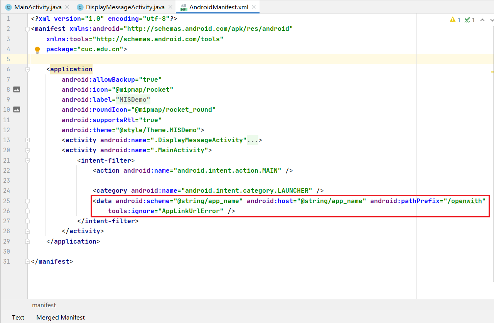

  + 隐藏效果如下图所示：

    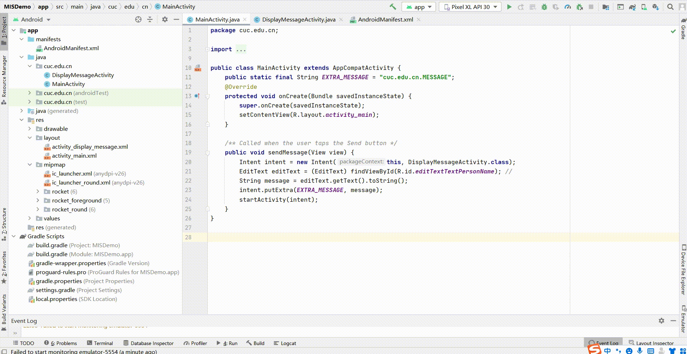

## HelloWorld v2

在v1基础之上，我们增加以下新功能来为后续的程序逆向和组件安全实验做一些“标靶”

+ 使用 `SharedPreferences` 持久化存储小数据并按需读取
+ 实现一个简单的注册码校验功能

按照[课本](https://c4pr1c3.github.io/cuc-mis/chap0x06/exp.html#hello-world-v2)操作, 效果如下：

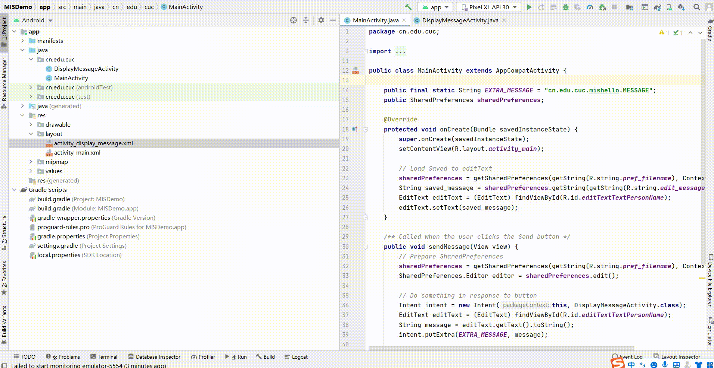

### 回答问题

+ `DisplayMessageActivity.java` 中的2行打印日志语句是否有风险？如果有风险，请给出漏洞利用示范。如果没有风险，请给出理由。

  + 我没发现有什么风险。。。但[同学的作业](https://github.com/CUCCS/2021-mis-public-LyuLumos/tree/ch0x06)启发我它是有风险的。因为它输出了MD5哈希值的前四位，可能会更容易被破解。

+ `SharedPreferences` 类在进行读写操作时设置的 `Context.MODE_PRIVATE` 参数有何作用和意义？还有其他可选参数取值吗？

  + **MODE_PRIVATE**：为默认操作模式，代表该文件是私有数据，只能被应用本身访问，在该模式下，写入的内容会覆盖原文件的内容，如果想把新写入的内容追加到原文件中，可以使用`Context.MODE_APPEND`
  + **MODE_APPEND**：模式会检查文件是否存在，存在就往文件追加内容，否则就创建新文件。
  + **MODE_WORLD_READABLE**：表示当前文件可以被其他应用读取；
  + **MODE_WORLD_WRITEABLE**：表示当前文件可以被其他应用写入

## 遇到的问题

+ 在做**让我们的 `cuc.edu.cn.misdemo` 程序出现在“用于打开浏览器的应用程序选择列表”** 这个子实验时，试了很多次，都是直接用Chrome打开的，没有达到想要的结果。后来想到，可能是第一次打开Chrome时，它询问是否将它设为默认浏览器，手一抖点了“是”。。。查看“setting”果然如我所想。

  + 由于不知道如何取消这个默认设置，所以新建了一个模拟器完成了此子实验。

+ 运行一个模拟器后，卡，太卡了。。。

  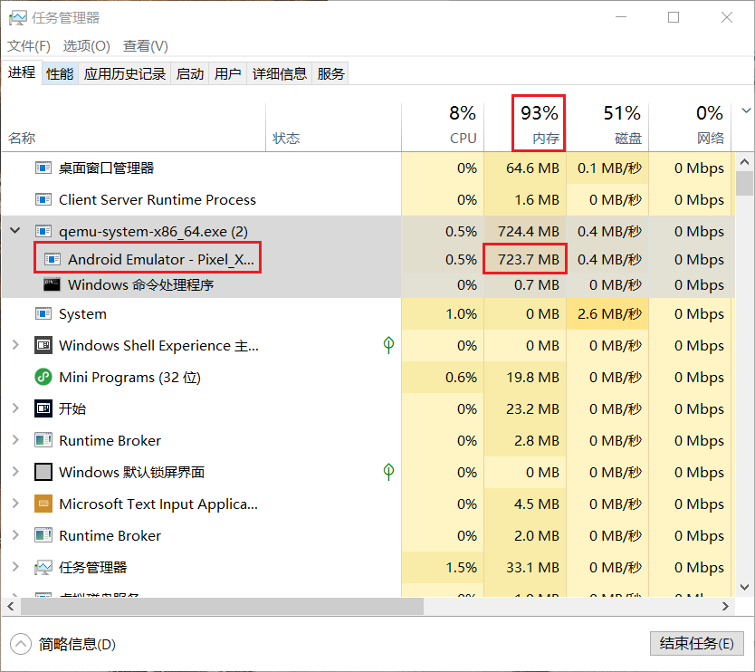
  
  + 尽量别运行非必要软件，慢慢做......

## 参考资料

+ [第六章 安卓系统访问控制策略与机制](https://c4pr1c3.github.io/cuc-mis/chap0x06/exp.html)
+ [Android Studio开发者文档](https://developer.android.google.cn/studio/intro)
+ [“adb”不是内部或外部命令，也不是可运行的程序或批处理文件——解决方案](https://blog.csdn.net/y201314an/article/details/81022556)
+ [ADB（四）---调用软件包管理器（pm）](https://blog.csdn.net/qq_19982677/article/details/115319041)
+ [Android studio如何更改应用程序的图标以及名称](https://blog.csdn.net/zhangkaidsy/article/details/74852470)
+ [Android studio隐藏app应用图标](https://blog.csdn.net/rgen_xiao/article/details/51219184)
+ [同学的作业](https://github.com/CUCCS/2021-mis-public-LyuLumos/tree/ch0x06)
