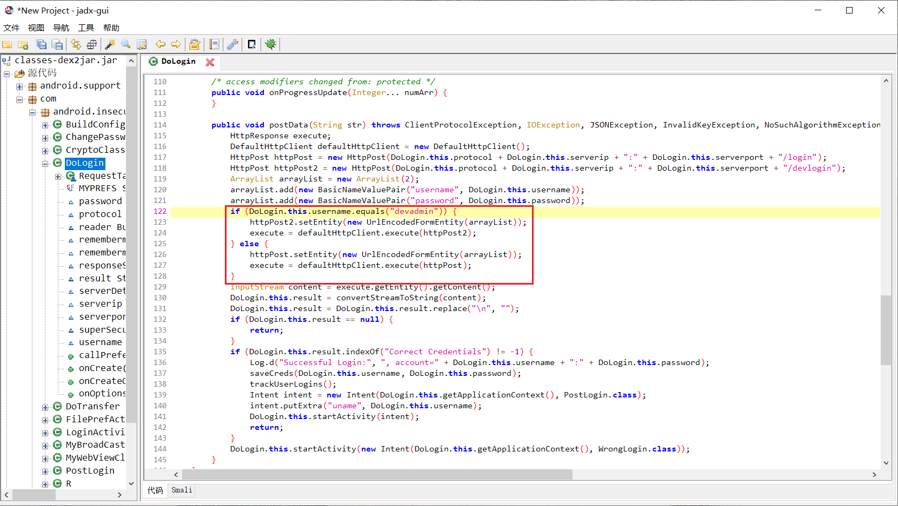

# Android 缺陷应用漏洞攻击实验

## 实验目的

+ 理解 Android 经典的组件安全和数据安全相关代码缺陷原理和漏洞利用方法；
+ 掌握 Android 模拟器运行环境搭建和 `ADB` 使用；

## 实验环境

+ [Android-InsecureBankv2](https://github.com/c4pr1c3/Android-InsecureBankv2)
+ Android Studio 4.2.1
+ adb
+ [JADX](https://github.com/skylot/jadx.git)
+ [drozer](https://github.com/mwrlabs/drozer)

## 实验要求

+ [x] 详细记录实验环境搭建过程；
+ [x] 至少完成以下 [实验](https://github.com/c4pr1c3/Android-InsecureBankv2/tree/master/Walkthroughs) ：
  + [x] Developer Backdoor
  + [x] Insecure Logging
  + [x] Android Application patching + Weak Auth
  + [x] Exploiting Android Broadcast Receivers
  + [x] Exploiting Android Content Provider
+ [x] （可选）使用不同于 [Walkthroughs](https://github.com/c4pr1c3/Android-InsecureBankv2/tree/master/Walkthroughs) 中提供的工具或方法达到相同的漏洞利用攻击效果；推荐 [drozer](https://github.com/mwrlabs/drozer)

## 实验过程

### 搭建InsecureBankv2环境

+ 使用2.7版本的python

  

+ 下载 InsecureBankv2

  

+ 安装必备软件

  

+ 安装`InsecureBankv2.apk`并启动

  

+ 运行 app.py

  

+ 使用`jack/Jack@123$` 或 `dinesh/Dinesh@123$`即可登录

  

+ 

### Developer Backdoor

+ 安装JADX

  

+ 下载dex2jar并解压缩

  

+ 解压缩`InsecureBankv2.apk`,并将`classes.dex`复制到`dex2jar-2.0`目录下

  

+ 将`.dex`文件转换为`.jar`文件

  

+ 使用`JADX-GUI`打开`classes-dex2jar.jar`,找到隐藏的后门代码

  

+ 使用用户名为`devadmin`可以任意密码登录

  

### Insecure Logging

+ 在`classes-dex2jar.jar`中发现，会在日志中输出用户名和密码

  

+ 使用`adb logcat`将日志输出。使用`dinesh`登录并将密码改为`$321@hseniD`

  

+ 日志中以明文记录了登录使用的用户名和密码

  

+ 日志中以明文记录了修改的密码

  

### Android Application patching + Weak Auth

+ 对`InsecureBankv2.apk`进行反编译

  

+ 编辑`String.xml`

  

+ 重打包

  

+ 重签名

  

+ 重安装

  

+ 打开应用，多了“创建用户”，说明获取了管理员的权限。(实际上此功能还没有开发出来。。。)

  

### Exploiting Android Broadcast Receivers

+ 打开 `AndroidManifest.xml` ，发现了`theBroadcast`,一个广播接收器

  

+ 找到传递给广播接收器的参数

  

+ 绕过登录直接修改密码,发现模拟器收到了修改密码的短信

  ```bash
  adb shell am broadcast -a theBroadcast -n com.android.insecurebankv2/com.android.insecurebankv2.MyBroadCastReceiver --es phonenumber 5554 –es newpass $321@hseniD
  ```

  

### Exploiting Android Content Provider

+ 打开 `AndroidManifest.xml` ，发现了`TrackUserContentProvider`,跟踪模块

  

+ 发现输入的数据会被保存

  

+ 在`adb shell`中输入命令，找到了明文保存的登录记录

  ```bash
  # adb shell
  content query --uri content://com.android.insecurebankv2.TrackUserContentProvider/trackerusers
  ```

  

### 使用 drozer 攻击

+ 下载[drozer](https://github.com/FSecureLABS/drozer/releases)并安装，需要安装到`python`所在目录

  

+ 下载[drozer-agent-2.3.4.apk](https://github.com/mwrlabs/drozer/releases/download/2.3.4/drozer-agent-2.3.4.apk)并安装到模拟器

  

+ 连接模拟器

  ```bash
  # 转发端口
  adb forward tcp:31415 tcp:31415

  # 连接
  drozer console connect
  ```

  

+ 以`Exploiting Android Content Provider`为例进行攻击

  

## 遇到的问题

+ 在做`Exploiting Android Content Provider`子实验时，没有得到预期的输出结果：

  

  + 经过多次尝试，依然没有得到想要的结果。然后发现是因为把运行`app.py`的窗口关掉了。重新运行`app.py`即可。

## 参考资料

+ [第八章 移动终端应用攻防与代码最佳安全实践](https://c4pr1c3.github.io/cuc-mis/chap0x08/exp.html)
+ [drozer安装使用教程（Windows）](https://www.cnblogs.com/lsdb/p/9441813.html)
+ [解决"pip Fatal error in launcher: Unable to create process using ... "的错误](https://blog.csdn.net/weixin_39278265/article/details/82938270)